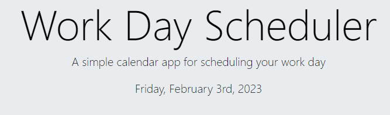
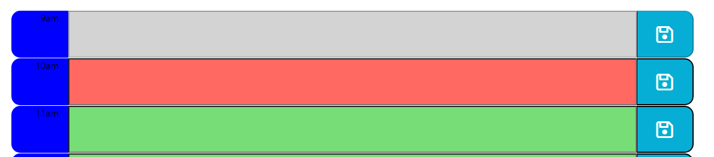

# Work-Day-Sceduler
Make a functional planner using jQuiry.

## Description
The goal of this Project was to create a simple calendar application that allows a user to save events for each hour of the day. To work upon this scheduler we have basic files like HTML, CSS, Java Script and used jQuery to create all interactivity. This Project shows how using jQuery we can make the code easier to read and understand, apply to the functionality on a web page. As for the user, it may become an every-day tool that helps organize the working day.

## Instalation
N/A

### Usage
The starter code that was given contained an HTML file, which included all the links needed and a jumbotron secion, so basically there was a header seen on the browser screen and some CSS styles were applied to the page already. A large portion of the whole work was to biult a Bootstrap container and add rows for each hour. Plus add id and class attributes to work with in JS as well.
A date, shown in the header, appeared using jQuery Moments. This is a useful tool that is able to keep the date and time updated.

A user can make some notes for specific hour inside of the input field, click the save button and that event will ba saved on the local storage. After refreshing the page all inputs are being retreived from local storage and displayed where they were. The current hour appears in red color, future hour in green and passed hour in grey, where input is disabled.

The next day all the input fields will be empty, so user can make some new notes.

### Credits 
N/A

### License
Please refer to the LICENSE in the repo.

This Project was deployed on GitHub Pages https://sashak2609.github.io/Work-Day-Sceduler/
